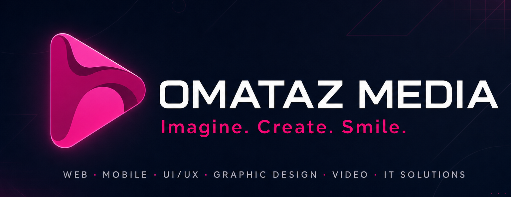

  

<h1 align="center">Omataz Media</h1>
<h3 align="center">Professional IT &amp; Digital Solutions · Imagine. Create. Smile.</h3>

  
  
  
  

---

### 👋 About Omataz Media

**Omataz Media** is a full-service IT & digital solutions company headquartered in **Abuja & Lagos, Nigeria**, delivering for clients worldwide **since 2017**. We partner with startups, SMEs, and enterprises to design, build, and scale digital products that drive real business results — combining engineering rigor with strong brand and visual design.

From first concept to launch and beyond, we own the full lifecycle: **strategy → design → development → deployment → growth**. Our team blends web & mobile engineering, UI/UX, video & motion, and IT infrastructure under one roof, so you get a single accountable partner instead of juggling vendors.

- 🎯 **Outcome-driven** — we measure success by your growth, not just deliverables
- 🤝 **One team, end-to-end** — design, build, ship, and support in-house
- 🌍 **Local roots, global standards** — based in Nigeria, building for clients everywhere
- 💬 Let's talk: **[omatazmedia.com.ng](https://omatazmedia.com.ng)** · **omatazmedia@gmail.com**

---

### 🚀 What we do

| | |
|---|---|
| 💻 **Web Development** | Custom sites, eCommerce, web apps, CMS, PWAs, APIs |
| 📱 **Mobile Apps** | Native & cross-platform (React Native, Flutter) |
| 🧱 **Custom Software & SaaS** | Bespoke platforms, dashboards, multi-tenant SaaS products |
| 🛒 **E-commerce & Payments** | Online stores, POS, payment gateways & checkout flows |
| 🎨 **UI/UX & Graphic Design** | Research, wireframes, design systems, branding |
| ✨ **Branding & Logo Design** | Visual identity, logos, brand guidelines |
| 🎬 **Video & Animation** | Explainers, motion graphics, brand storytelling |
| ☁️ **Cloud & DevOps** | AWS/Azure, CI/CD, hosting, monitoring & scaling |
| 🗄️ **Database & Integrations** | Database design, systems integration, data pipelines |
| 🔌 **API Development** | REST/GraphQL APIs & third-party integrations |
| 📝 **WordPress & CMS** | WordPress, headless CMS, content-managed sites |
| 🔧 **IT Solutions & Consultancy** | Cloud, automation, security, infrastructure |
| 🌐 **Networking** | Network design, security, VPN, monitoring |
| 📈 **SEO & Digital Marketing** | SEO, content writing, social, PPC, analytics |
| 🛠️ **Support & Maintenance** | Retainers, updates, monitoring & ongoing support |

---

### 🛠️ Tech we build with

  
  
  
  
  
  
  
  
  
  
  

---

### 📊 GitHub stats

  
  

---

<i>Imagine. Create. Smile.</i> — Let's build something people love. 🚀

